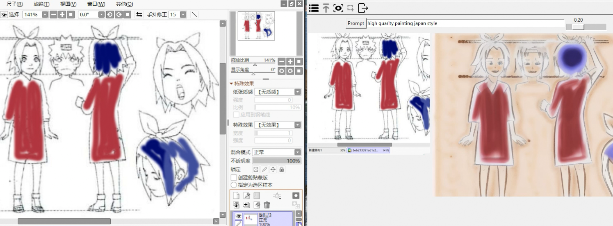
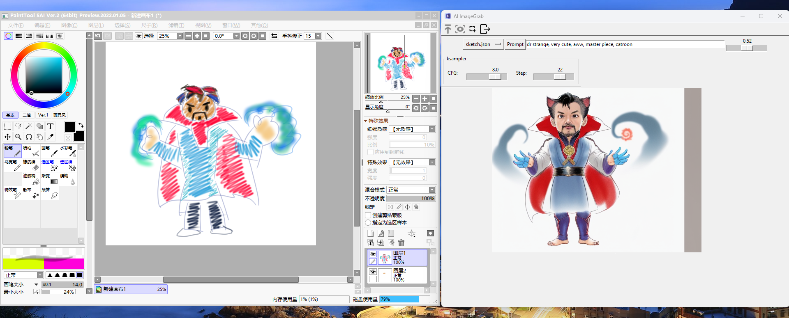
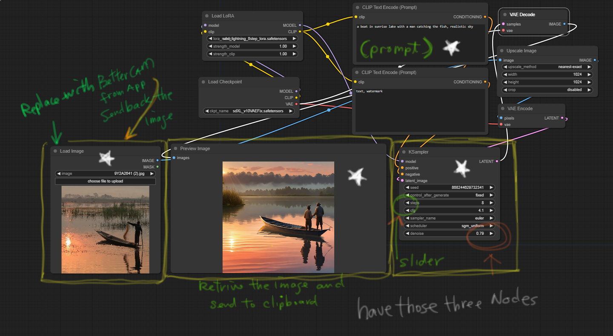

# AI ImageGrab Application with Comfyui Workflow API

The AIGrab application with Comfyui Workflow Adapter is a Python-based tool designed for image processing and manipulation. It provides a graphical user interface (GUI) for users to interact with and perform various image-related tasks. The application utilizes tkinter for the GUI, PIL for image handling, threading for concurrency, and websocket for communication with a server via Comfyui's workflow adapter.



(how it works make sure the load image, Ksampler, and Save image nodes are available)


(https://youtu.be/KU9LEyaDE34)
## Features

- **Workflow**: Select your favorite workflow from the dropdown menu.
- **Image Capture**: Captures image region selection from a screen device in real-time.
- **Image Processing**: Processes captured images using predefined workflows and user prompts fetched via Comfyui's workflow.
- **GUI Interface**: Provides an intuitive user interface with toolbar buttons, input fields, sliders, and canvas frames for image display.
- **WebSocket Communication**: Establishes communication with Comfyui's workflow adapter via WebSocket for fetching image data and processing instructions.
- **Clipboard**: Copy and paste processed images from the application to the clipboard.

## Usage

1. **Installation**: Ensure Python and required libraries are installed.
2. **Server Availability**: Check if the server hosting Comfyui's workflow adapter is available for WebSocket communication.
3. **Run Application**: Execute the Python script to launch the AIGrab application.
4. **Interact with GUI**: Use the GUI interface to capture images, input prompts, adjust parameters, and view processed images.
5. **Save Settings**: Optionally save application settings for future sessions.
6. **Exit Application**: Close the application when done.


## Installation

### Step 1: make sure comfyui is running     
### Step 2: Create Conda Environment

Open your terminal or command prompt and navigate to your project directory.

Use the following command to create a new Conda environment named `aigrab` and install the required packages:

```bash
conda create --name aigrab python=3.10 
conda activate aigrab
pip install -r requirenments.txt
python main.py
```

## License

This project is licensed under the [MIT License](LICENSE).

## Acknowledgments

- Credits to the developers and contributors of the libraries used in this project.
- Special thanks to [Comfyui](https://comfyui.com) for providing the workflow adapter and resources.

---

Feel free to adapt the README further to suit your preferences and requirements!
